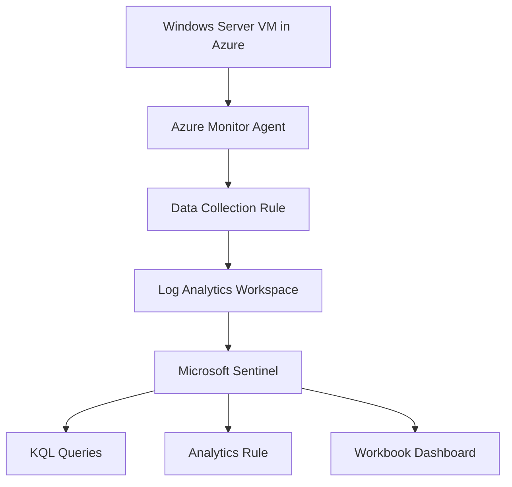

# Critical Infrastructure Cybersecurity Monitoring Lab

A Microsoft Sentinel lab that simulates security monitoring for a **critical infrastructure support environment** hosted in Azure. The project focuses on detecting suspicious authentication activity, monitoring privileged access, and creating Sentinel analytics and dashboards that demonstrate practical SOC workflows.

> This project does **not** claim to simulate a real OT/SCADA environment. It is an Azure-based monitoring lab designed to show how SIEM monitoring can support the protection of systems that support critical infrastructure.

## Project Objective

Build a small but credible cyber monitoring lab using:

- **Azure Virtual Machine (Windows Server)**
- **Log Analytics Workspace**
- **Microsoft Sentinel**
- **Azure Monitor Agent + Data Collection Rule**
- **Windows Security Events**
- **KQL detection queries**
- **Scheduled analytics rule**
- **Workbook/dashboard**

The main goal is to detect:

- Multiple failed logon attempts (possible brute force behaviour)
- Privileged account logons
- Suspicious PowerShell-related activity

## Why this project matters

Energy, transport, health, and utility organisations often operate critical services that depend on secure IT systems. This project demonstrates the core security monitoring skills needed to protect those environments:

- log collection
- alert triage
- KQL investigation
- basic detection engineering
- dashboarding
- containment mindset

## Architecture

## Lab Components

| Component | Purpose |
|---|---|
| Azure Resource Group | Holds all lab resources |
| Log Analytics Workspace | Stores collected security telemetry |
| Microsoft Sentinel | SIEM for investigation, detection, and dashboards |
| Windows Server VM | Test machine that generates authentication and PowerShell events |
| Azure Monitor Agent | Collects Windows events from the VM |
| Data Collection Rule | Defines which logs are sent to the workspace |

## Recommended Resource Names

- Resource Group: `rg-cic-monitoring-lab`
- Log Analytics Workspace: `law-cic-monitoring`
- Virtual Machine: `vm-cic-lab01`
- Data Collection Rule: `dcr-cic-security-events`
- Sentinel Rule: `Multiple Failed Logins Detected`

## Build Steps

### 1. Create Azure resources

Create the following in the same region:

- Resource Group
- Log Analytics Workspace
- Microsoft Sentinel enabled on the workspace
- Windows Server VM

### 2. Connect the VM to Sentinel

Install and configure:

- **Azure Monitor Agent** on the VM
- **Windows Security Events via AMA** data connector in Microsoft Sentinel
- **Data Collection Rule** to collect Windows Security logs

### 3. Generate test activity

Generate safe test data on the VM:

- multiple failed sign-in attempts to create **Event ID 4625**
- admin logon activity to observe **Event ID 4672**
- PowerShell commands to generate script/process activity

### 4. Investigate in Sentinel

Use KQL to inspect the `SecurityEvent` table and validate that logs are flowing.

### 5. Create detections

Build KQL queries and one scheduled analytics rule for failed logons.

### 6. Create a workbook

Visualise:

- failed logons over time
- failed logons by account
- failed logons by computer
- privileged logon events

## Detection Use Cases

### Use Case 1: Brute-force style failed logons

This identifies accounts and hosts with repeated failed logon attempts.

See: [`kql/failed_logons.kql`](kql/failed_logons.kql)

### Use Case 2: Privileged account visibility

This shows privileged logons using **Event ID 4672**.

See: [`kql/privileged_logons.kql`](kql/privileged_logons.kql)

### Use Case 3: Suspicious PowerShell keyword hunting

This looks for common suspicious PowerShell indicators.

See: [`kql/suspicious_powershell.kql`](kql/suspicious_powershell.kql)

## Example Analytics Rule

Rule name: **Multiple Failed Logins Detected**

- Severity: Medium
- MITRE ATT&CK: Brute Force
- Run frequency: every 5 minutes
- Lookup period: last 1 hour
- Trigger: greater than 0 results

See: [`docs/analytics-rule.md`](docs/analytics-rule.md)

## Workbook Ideas

Suggested workbook sections:

1. Failed logons over time
2. Top targeted accounts
3. Top systems generating failed logons
4. Privileged logon events
5. Notes / investigation observations

See: [`docs/workbook-guide.md`](docs/workbook-guide.md)

## Project Outcomes

By completing this lab, I was able to:

- build a Microsoft Sentinel monitoring environment in Azure
- collect Windows Security Events using Azure Monitor Agent
- investigate failed authentication activity using KQL
- create a Sentinel analytics rule for suspicious logon behaviour
- design workbook visualisations to support SOC monitoring

## Future Improvements

- Integrate Defender for Endpoint for richer telemetry
- Add incident playbooks with Logic Apps
- Add custom watchlists for suspicious IPs
- Expand detections to cover lateral movement and persistence activity

## Disclaimer

This lab was created for educational and portfolio purposes in a personal Azure environment using safe, controlled test activity.
